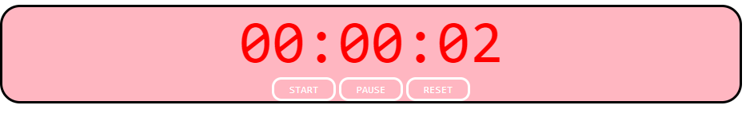

# Timer App

## Project Overview
This project implements a simple timer using HTML, CSS, and JavaScript. The timer includes basic functionalities such as start, pause, and reset, providing a user-friendly interface.

## Timer Details
- **Timer Display**: Shown in a 00:00:00 format with a font size of 75px and a red color.
- **Control Buttons**: Three buttons - START, PAUSE, and RESET. They are styled with the "timerButton" class.
- **Button Styling**: Buttons have a width of 80px, height of 30px, and a light pink background color with white text.

## How to Use
1. Open the `index.html` file in a web browser.
2. Click the **START** button to initiate the timer.
3. Click the **PAUSE** button to pause the running timer.
4. Click the **RESET** button to set the timer back to 00:00:00.

## JavaScript Logic
- **Variables**: The script uses variables to store timer-related data, including start time, elapsed time, and current time.
- **Event Listeners**: Event listeners are employed to respond to button clicks on START, PAUSE, and RESET buttons.
- **Update Time Function**: The `updateTime` function calculates elapsed time, updates hours, minutes, and seconds, and refreshes the timer display.
- **Padding Function**: The `pad` function ensures that single-digit hours, minutes, and seconds are displayed with a leading zero.

## Applied Skills and Technologies
- **CSS Styling**: Implemented stylings to enhance the visual appeal of the timer.
- **DOM Manipulation**: Utilized query selectors to dynamically interact with the Document Object Model (DOM).
- **Arrow Functions**: Employed arrow functions for concise and efficient coding.

## Project Files
- `index.html`: HTML file defining the timer structure.
- `style.css`: CSS file for styling the timer.
- `index.js`: JavaScript file containing the timer logic.

This project demonstrates applied skills in CSS styling, DOM manipulation, and the use of arrow functions. It served as a basic exercise for me in creating an interactive timer using HTML, CSS, and JavaScript.

-- Sophia
